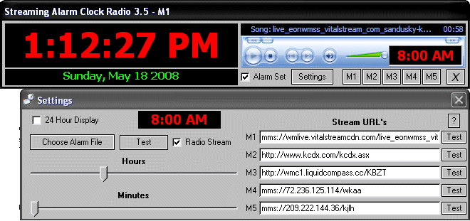



## Streaming Radio Alarm Clock 3\.5

### Description

A streaming internet alarm clock radio. Features include internet detection with backup alarm sound file. 12 or 24 hour display with date. All savings are saved to the registry. No resetting the alarm every day, it can be added to the start up. Tray enabled for quick access. Automatic mixer un-muting and 90% volume crank at alarm time. When you press stop on media player after alarm is playing it returns your mixer volume back to the originally set volume. You can also set the media player volume individually for each memory station and it is saved. Up to 5 preset stream links can be set from interface to point to any internet stream you like. I have included a huge file full of stream links to help users to pick stations. This program is full of features you are sure to love !

The original version of this submission 'Big Red Radio Alarm Clock' was missing some of the settings code and hung at windows shutdown. I have reconstructed the code to fix that problem. I also had trouble with the original stations stream link going down. I guess because I made the mistake of telling them about the program. Oh well their are thousands of radio stations out their with feeds that still work. So its that stations loss of listeners by them shutting off their stream. I have included a small list of some stations to help. More can be gotten from http://www.radio-locator.com and elsewhere. Also you can get the K-Lite Codec Pack to be able to listen to streaming MP3 broadcasts. This program is also available from my website in full installer form. http://www.tas-independent-programming.com

Requires windows media player 7.0 or up. Your mornings will never be the same. Enjoy !!!
 
### More Info
 

             |
---                |---
**Submitted On**   |2008-05-21 07:45:36
**By**             |[Thomas Swift](https://github.com/Planet-Source-Code/PSCIndex/blob/master/ByAuthor/thomas-swift.md)
**Level**          |Intermediate
**User Rating**    |3.7 (11 globes from 3 users)
**Compatibility**  |VB 6\.0
**Category**       |[Sound/MP3](https://github.com/Planet-Source-Code/PSCIndex/blob/master/ByCategory/sound-mp3__1-45.md)
**World**          |[Visual Basic](https://github.com/Planet-Source-Code/PSCIndex/blob/master/ByWorld/visual-basic.md)
**Archive File**   |[Streaming\_2113415212008\.zip](https://github.com/Planet-Source-Code/thomas-swift-streaming-radio-alarm-clock-3-5__1-70561/archive/master.zip)

